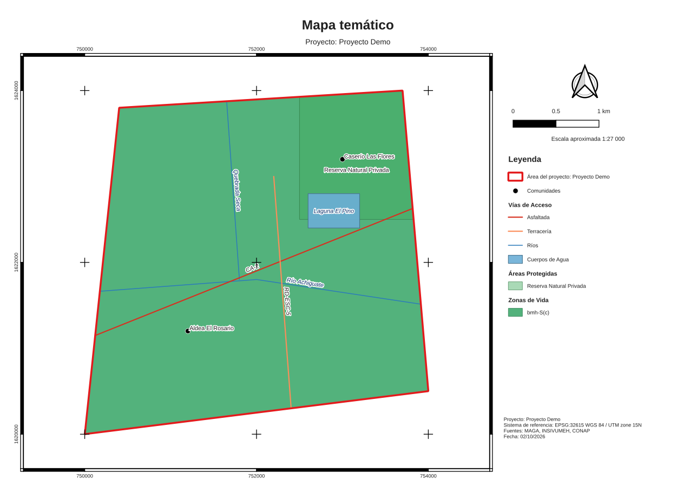

# qgis-mcp

Servidor [MCP](https://modelcontextprotocol.io) que genera mapas temáticos con QGIS
sobre el shape (polígono) de un proyecto. Funciona sin abrir QGIS: usa PyQGIS en modo
sin interfaz y entrega el mapa en PDF/PNG, las capas recortadas en un GeoPackage y un
proyecto `.qgz` para seguir editando en QGIS.

## Capas que sabe dibujar

| Clave | Capa | Estilo por defecto | Recorte por defecto |
|---|---|---|---|
| `ubicacion` | Ubicación (país, departamentos, municipios) | un color, etiquetas por municipio | ninguno, el mapa se ajusta a la capa |
| `rios` | Ríos | línea azul, etiqueta curva | al shape |
| `zonas_vida` | Zonas de Vida (Holdridge) | por categoría | al shape |
| `vias_acceso` | Vías de Acceso | por tipo de vía | al shape |
| `cuencas` | Cuencas Hidrográficas | por cuenca | al shape |
| `cuerpos_agua` | Cuerpos de Agua | relleno azul | al shape |
| `areas_protegidas` | Áreas Protegidas | por categoría de manejo | al shape |
| `temperatura_thornthwaite` | Temperatura (Thornthwaite) | por clase | al shape |
| `precipitacion_media` | Precipitación Media Anual | rangos (Jenks) o ráster en 5 clases | al shape |
| `humedad_thornthwaite` | Humedad (Thornthwaite) | por clase | al shape |
| `indice_humedad` | Índice de Humedad | rangos o ráster | al shape |
| `taxonomia_suelos` | Taxonomía de Suelos | por orden | al shape |
| `uso_suelo` | Uso de Suelo | por categoría | al shape |
| `comunidades` | Comunidades | punto negro con nombre | al marco del mapa |
| `volcanes` | Volcanes de la región | triángulo rojo con nombre | ninguno, margen regional amplio |

El campo para clasificar y el de etiquetas se detectan solos (por ejemplo `ZONA_VIDA`,
`CUENCA`, `ORDEN`, `USO`, `NOMBRE`); se pueden indicar con `field` y `label_field`.
El área del proyecto siempre se dibuja encima como contorno rojo.

Cada hoja lleva título, leyenda (solo con lo visible), norte, barra de escala, escala
numérica, cuadrícula de coordenadas y una nota con proyecto, sistema de referencia,
fuentes y fecha.



## Herramientas

| Herramienta | Qué hace |
|---|---|
| `list_layer_types` | Lista las 15 capas, sus campos esperados y recortes por defecto |
| `inspect_dataset` | Muestra CRS, geometría, campos y valores de ejemplo de un archivo |
| `set_project_area` | Define el shape del proyecto (y opcionalmente el CRS de salida, p. ej. `EPSG:32615`) |
| `add_layer` | Agrega o reemplaza una capa temática a partir de un archivo vectorial o ráster |
| `remove_layer`, `reset_map`, `get_map_state` | Administran el mapa en construcción |
| `generate_map` | Una hoja con varias capas (PDF, PNG, JPG o TIF según la extensión) |
| `generate_map_series` | Una hoja por capa: Mapa de Zonas de Vida, Mapa de Cuencas, etc. |

Ejemplo de conversación: *"Usa `C:/proyecto/area.shp` como área del proyecto, agrega
zonas de vida, cuencas, ríos y volcanes de `C:/datos/`, y genera la serie de mapas en
A3 con ríos como referencia en cada hoja."*

## Instalación

Necesitas QGIS 3.28 o superior (probado con 3.34) y su Python, porque PyQGIS no se
instala desde PyPI.

**Linux (Debian/Ubuntu)**

```bash
sudo apt install qgis python3-qgis
python3 -m venv --system-site-packages .venv
.venv/bin/pip install -e .
```

**Windows (OSGeo4W o instalador de QGIS)**: abre la *OSGeo4W Shell* y ejecuta
`python -m pip install -e .` dentro de esta carpeta.

**macOS**: usa el Python que trae QGIS
(`/Applications/QGIS.app/Contents/MacOS/bin/python3`) y define
`QGIS_PREFIX_PATH=/Applications/QGIS.app/Contents/MacOS`.

### Configurar el cliente MCP

Claude Desktop (`claude_desktop_config.json`), en Linux:

```json
{
  "mcpServers": {
    "qgis": {
      "command": "/ruta/a/qgis-mcp/.venv/bin/python",
      "args": ["-m", "qgis_mcp"]
    }
  }
}
```

En Windows, el comando es el Python de QGIS, por ejemplo
`C:\\Program Files\\QGIS 3.34.4\\bin\\python-qgis.bat` con `"args": ["-m", "qgis_mcp"]`.

## Desarrollo

```bash
.venv/bin/pip install -e '.[test]'
.venv/bin/python -m pytest
```

Las pruebas crean datos sintéticos de las 15 capas alrededor de un proyecto ficticio en
Guatemala (`tests/sample_data.py`) y generan mapas reales con QGIS. Sin PyQGIS, solo se
ejecutan las pruebas del catálogo y del servidor.
